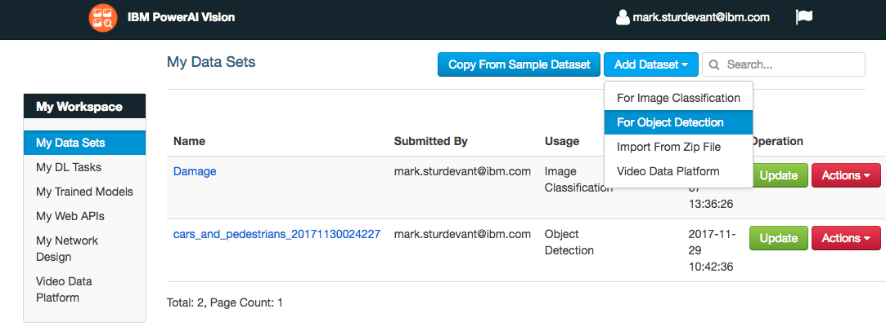
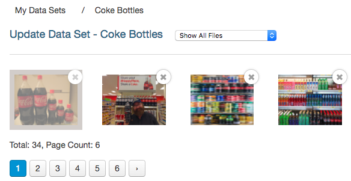
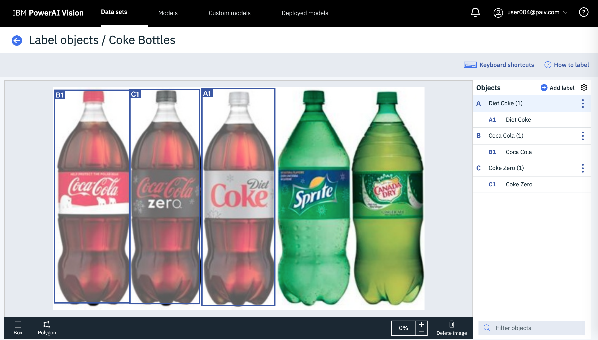
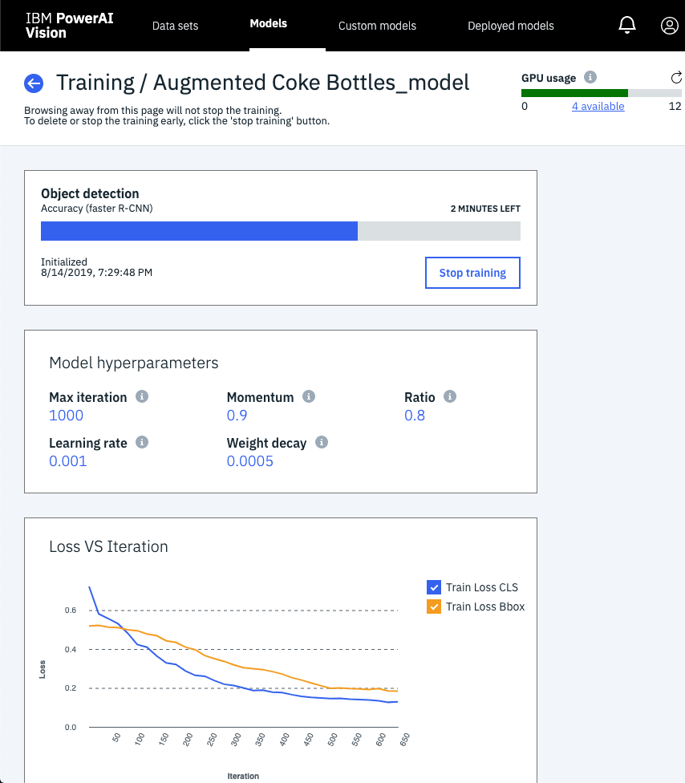
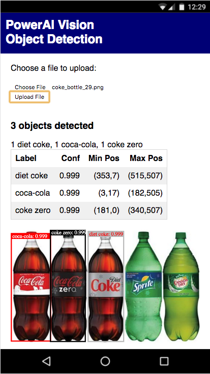

*他の言語で読む: [English](README.md).*

# PowerAI Vision によるオブジェクト検出

このコードパターンでは、PowerAI Vision Object Detection を使用して、カスタマイズされたトレーニングに基づいて、イメージ内のオブジェクトを検出してラベル付けします。

> この例は、独自のデータセットで容易にカスタマイズできます。

サンプル用のデータセットとして、コカ・コーラの瓶の画像を使用します。
モデルをトレーニングして展開すると、画像内のコーラ瓶を見つけてカウントできる REST エンドポイントが作成できます。

ディープラーニング (深層学習) トレーニングを使用して、オブジェクト検出のモデルを作成します。
PowerAI Vision では、数回のマウスクリックだけで深層学習を実施できます。
タスクが完了すると、もう一度クリックしてモデルをデプロイできます。

PowerAI Vision は、推論操作のための REST API を提供しています。
カスタムモデルによるオブジェクト検出は、任意の REST クライアントから使用でき、PowerAI Vision UI でもテストできます。

このコード・パターンをひと通り完了すると、以下の方法がわかるようになります:

* PowerAI Vision を使用してオブジェクトを検出する対象のデータセットを作成する
* データセットに基づいてモデルをトレーニングし、デプロイする
* REST 呼び出しを使用してモデルをテストする


## Flow

1. 画像をアップロードして PowerAI Vision データセットを作成します。
2. トレーニングを実行する前に、画像データセット内のオブジェクトにラベルを付けます。
3. PowerAI Vision 内でモデルをトレーニング、デプロイ、テストします。
4. REST クライアントを使用して、画像内のオブジェクトを検出します。

## 含まれるコンポーネント

* [IBM Power Systems](https://www-03.ibm.com/systems/power/): オープンテクノロジーで構築され、ミッションクリティカルなアプリケーション用に設計されたサーバー。
* [IBM PowerAI](https://www.ibm.com/ms-en/marketplace/deep-learning-platform): 深層学習、機械学習、AIをよりアクセスしやすくし、パフォーマンスを改善するソフトウェアプラットフォーム。
* [IBM PowerAI Vision Technology Preview](https://developer.ibm.com/linuxonpower/deep-learning-powerai/technology-previews/powerai-vision/): コンピュータビジョンのための深層学習モデルをトレーニングし、デプロイして、データセットにラベルを付けするための一貫したエコシステム。

## 利用した技術

* [Artificial Intelligence](https://medium.com/ibm-data-science-experience): 人工知能を分散したソリューション空間に適用して、破壊的技術(新しい価値基準の下で従来よりも優れた特長を持つ新技術)を提供します。
* [Node.js](https://nodejs.org/): サーバー側でJavaScriptコードを実行するためのオープンソースのJavaScriptランタイム環境。

# ビデオを観る

[](https://www.youtube.com/watch?v=xoLcXQs4SP4)

# 前提条件

*このコードパターンは、PowerAI Vision Technology Preview v3.0 でビルドされました。*

* `SuperVessel` クラウドを使用してプレビューを試すには、[こちら](https://ny1.ptopenlab.com/AIVision) でログインまたは登録してください。

* Power Systems を所有しており、インストーラをダウンロードして自分のシステムにプレビューをデプロイする場合は、[こちら](https://www-01.ibm.com/marketing/iwm/iwm/web/preLogin.do?source=mrs-eibmpair) で登録します。

> ノート: この README の手順と例は、SuperVessel の使用を想定しています。たとえば、幾つかの URL は ny1.ptopenlab.com を使用しています。

# 手順

1. [GitHub リポジトリーを複製する](#1-clone-the-repo)
2. [PowerAI Vision にログインする](#2-login-to-powerai-vision)
3. [新規データセットを作成する](#3-create-a-dataset)
4. [タグを作成しオブジェクトにラベルを付ける](#4-create-tags-and-label-objects)
5. [深層学習 (DL) タスクを作成する](#5-create-a-dl-task)
6. [モデルをデプロイしてテストする](#6-deploy-and-test)
7. [アプリを実行する](#7-run-the-app)

<a name="1-clone-the-repo"></a>
### 1. GitHub リポジトリーを複製する

`powerai-vision-object-detection` をローカル環境にクローンします。ターミナルで次のコマンドを実行:

```
git clone https://github.com/IBM/powerai-vision-object-detection
```

<a name="2-login-to-powerai-vision"></a>
### 2. PowerAI Vision にログインする

SuperVessel を使用している場合は、こちらでログインします: https://ny1.ptopenlab.com/AIVision/index.html

<a name="3-create-a-dataset"></a>
### 3. 新規データセットを作成する

PowerAI Vision Object Detection は、ユーザーと開発者がカスタマイズしたトレーニングに基づいて、画像内のオブジェクトのインスタンスを数えることができます。そして画像内のオブジェクトを検出してラベル付けします。

オブジェクト検出トレーニング用の新しいデータセットを作成するには:

* `My Data Sets` ビューから `Add Dataset` ボタンをクリックし、プルダウンで `For Object Detection` を選択します。

  

* データセット名を入力し、`Add Dataset` をクリックします。

  

* ドラッグ＆ドロップや `Select some` を使用して1つ以上の画像をアップロードします。一度に多くをアップロードするため、クローンしたリポジトリから [powerai-vision-object-detection/data/coke_bottles.zip](https://github.com/IBM/powerai-vision-object-detection/raw/master/data/coke_bottles.zip) を使うことができます。

  

  > ノート: 独自の zip ファイルを使用して、アップロード後にファイルサムネイルが表示されない場合は、そのアップロードは失敗しています。特殊文字やスペースを使用せずに、小文字のファイル名を使用してください。個々のファイルをアップロードしたり、幾つかのファイルを一度に複数選択して、どのファイルがアップロードを失敗させたのかを判断することもできます。

<a name="4-create-tags-and-label-objects"></a>
### 4. タグを作成しオブジェクトにラベルを付ける

* `+` アイコンをクリックして新しいタグを作成します。 各タグは、特定の使用例 (コカコーラ、ダイエットコーラ、コーラゼロなど) に基づいて画像内のトレーニングオブジェクトを表します。

* タグを選択し、画像内のオブジェクトの周囲にあるバウンディングボックス内にドラッグすると、各画像のオブジェクトにラベルを付けることができます。それぞれの画像ごとに設定して `Save` を押します。

* すべてのタグとすべての画像に対してこのプロセスを繰り返します。

  > ノート: ラベル付けを既に実施済みの状態でエクスポートした [powerai-vision-object-detection/data/coke_bottles_exported.zip](https://github.com/IBM/powerai-vision-object-detection/raw/master/data/coke_bottles_exported.zip) ファイルをインポートすることにより、上記の設定の手間を省くこともできます。

  

  > ヒント: `Only Show Unlabeled Files` プルダウンを使用すると、実行を完了したことが判断し易くなります。

* `Data Augmentation` ボタンを使ってデータセットを拡張することができます。元のイメージに最初にラベルを付け、ミラーイメージ (水平または垂直) がユースケースに合致しているかどうかを確認してください。データ拡張機能を使用すると、新しい拡張データセットが作成されます。

* あなたの仕事のコピーを保存するには、`Export As Zip File` をクリックしてください。ラベルを付けるのには時間がかかるので、何か問題が発生した場合、この zip ファイルから作業をやり直すことができます。

<a name="5-create-a-dl-task"></a>
### 5. 深層学習 (DL) タスクを作成する

* My Workspace の下にある `My DL Tasks` をクリックし、`Create New Task` ボタンをクリックします。`Object Detection` をクリックします。

* Object Detector に名前を付け、データセットが選択されていることを確認し、`Build Model` をクリックします。

  

* 実行時間の予測を含んだ、確認ダイアログが表示されます。`Create New Task` をクリックして開始します。

  

<a name="6-deploy-and-test"></a>
### 6. モデルをデプロイしてテストする

* モデルがビルドされたら、`Deploy and Test` をクリックします。

  

* PowerAI Vision UI でモデルをテストします。 テスト画像を選択するには、`Select some` を使用します。結果は検出されたオブジェクトの数を示し、バウンディングボックス、ラベル、信頼スコアと共に画像が表示されます。

  

* コマンドラインから、画像ファイルと `curl` コマンドを使用して、配備された REST エンドポイントをテストすることができます。出力 JSON は複数の瓶が検出されたことを示し、それぞれの瓶には信頼性、ラベル、および場所が示されています。
  > 注意点: この例では便宜上 `--insecure` を使いました。

  ```bash
  $ curl --insecure -i -F files=@coke_bottle_23.png https://ny1.ptopenlab.com/AIVision/api/dlapis/9f9d6787-0183-4a1b-be49-751b6ca16724
  HTTP/1.1 100 Continue

  HTTP/1.1 200 OK
  Server: nginx/1.9.13
  Date: Thu, 14 Dec 2017 21:58:26 GMT
  Content-Type: application/json
  Content-Length: 508
  Connection: keep-alive
  Access-Control-Allow-Origin: *
  Access-Control-Allow-Headers: origin, content-type, accept, authorization
  Access-Control-Allow-Credentials: true
  Access-Control-Allow-Methods: GET, POST, PUT, DELETE, OPTIONS, HEAD
  Access-Control-Allow-Origin: *

  { "classified" : [ { "confidence" : 0.9986369013786316 , "ymax" : 578 , "label" : "coca-cola" , "xmax" : 755 , "xmin" : 588 , "ymin" : 29} , { "confidence" : 0.9954010248184204 , "ymax" : 592 , "label" : "coca-cola" , "xmax" : 601 , "xmin" : 437 , "ymin" : 10} , { "confidence" : 0.8161203265190125 , "ymax" : 567 , "label" : "coca-cola" , "xmax" : 426 , "xmin" : 259 , "ymin" : 17}] , "imageUrl" : "http://ny1.ptopenlab.com:443/AIVision/temp/5a26dd3b-d8ba-4e01-8b93-5a43f28e97c7.png" , "result" : "success"}
  ```

<a name="7-run-the-app"></a>
### 7. アプリを実行する

サンプルの Web アプリケーションは、画像をアップロードし、訓練されデプロイされたモデルを使用し、検出されたオブジェクトを画面上にバウンディングボックスとラベルを表示する方法を示しています。機能は上記のテストと似ていますが、カスタマイズするためのコードが用意されています。

次の [IBM Cloud にデプロイする](#deploy-to-ibm-cloud) **もしくは** [ローカル環境で実行する](#run-locally) セクションのどちらかを実行してください。

<a name="deploy-to-ibm-cloud"></a>
#### IBM Cloud にデプロイする

[](https://cloud.ibm.com/devops/setup/deploy?repository=https://github.com/IBM/powerai-vision-object-detection)

1. 上記の ``Deploy to IBM Cloud`` ボタンを押し、次に ``Deploy`` をクリックします。

2. ツールチェーンで、デリバリーパイプラインをクリックして、アプリケーションがデプロイされるのを待ちます。デプロイされた後、`View app` をクリックするとアプリを表示できます。

3. IBM Cloud ダッシュボードを使用してアプリを管理します。このアプリの名前は、`powerai-vision-object-detection` に、ユニークな接尾辞を追加したものです。

4. PowerAI Vision APIエンドポイントを追加します:
    * IBM Cloud ダッシュボードでアプリをクリックします。
    * サイドバーの `Runtime` を選択します。
    * 中央のボタンバーで `Environment variables` (環境変数) を押します。
    * `Add` ボタンを押します。
    * 名前 `POWERAI_VISION_WEB_API_URL` を追加し、配備した Web API の値を設定します(上記)。
    * `Save` ボタンを押します。アプリは自動的に再起動します。
    * アプリを使用するには、`Visit App URL` をクリックします。

<a name="run-locally"></a>
#### ローカル環境で実行する

複製されたリポジトリを使用し、Web アプリケーションをビルドして実行します。

> ノート: これらの手順は、``Deploy to IBM Cloud`` ボタンを使用する代わりに、ローカル環境で実行する場合にのみ必要です。

* env.sample を .env にコピーします。ファイルを編集して、さきほどデプロイした Web API を指すように URL を設定します。

* [Node.js](https://nodejs.org/en/download/) と [npm](https://docs.npmjs.com/getting-started/installing-node) があらかじめインストールされていることを前提として、 次のコマンドを実行します:
  ```
  cd powerai-vision-object-detection
  npm install
  npm start
  ```

* ブラウザを使用して Web UI を表示します。デフォルトの URLは http://localhost:8081 です。

#### Web アプリを使用する

* `Choose File` ボタンを使ってファイルを選択します。電話では、カメラを使用することもできます。ラップトップでは、画像ファイル (JPGまたはPNG) を選択します。

* Web API に画像を送信し、結果をレンダリングするには、`Upload File` ボタンを押してください。

  

* POWERAI_VISION_WEB_API_URL を構成しなかった場合、または API がデプロイされていない場合は、UIにエラーメッセージが表示されます (SuperVessel では1時間ごとにすばやく再デプロイできます)。

# リンク

* [Youtube上のデモ](https://www.youtube.com/watch?v=xoLcXQs4SP4): ビデオを観る
* [Object Detection](https://en.wikipedia.org/wiki/Object_detection): Wikipedia の説明
* [PowerAI Vision](https://developer.ibm.com/linuxonpower/deep-learning-powerai/technology-previews/powerai-vision/): 深層学習と PowerAI 開発
* [TensorFlow Object Detection](https://research.googleblog.com/2017/06/supercharge-your-computer-vision-models.html): TensorFlow オブジェクト検出 API を使用してコンピュータビジョン・モデルを強化する
* [AI Article](https://www.entrepreneur.com/article/283990): 人工知能は人よりも写真を識別できるか？
* [From the developers](https://developer.ibm.com/linuxonpower/2017/08/30/ibm-powerai-vision-speeds-transfer-learning-greater-accuracy-real-world-example/): IBM PowerAI Vision が、より正確な伝達学習を加速する、その実際の例

# もっと詳しく知る

* **Artificial Intelligence コードパターン**: このコードパターンを気に入りましたか？ [AI Code コードパターン](https://developer.ibm.com/jp/technologies/artificial-intelligence/) から関連パターンを参照してください。
* **AI and Data コードパターン・プレイリスト**: コードパターンに関係するビデオ全ての [プレイリスト](https://www.youtube.com/playlist?list=PLzUbsvIyrNfknNewObx5N7uGZ5FKH0Fde) です。
* **PowerAI**: AIのためのエンタープライズプラットフォーム上で機械学習用のソフトウェアを実行することで、より速く開始またはスケーリングできます: [IBM Power Systems](https://www.ibm.com/ms-en/marketplace/deep-learning-platform)


# ライセンス
[Apache 2.0](LICENSE)
